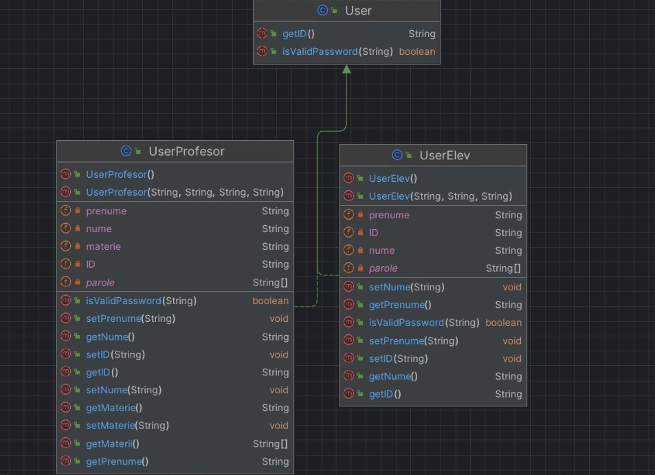
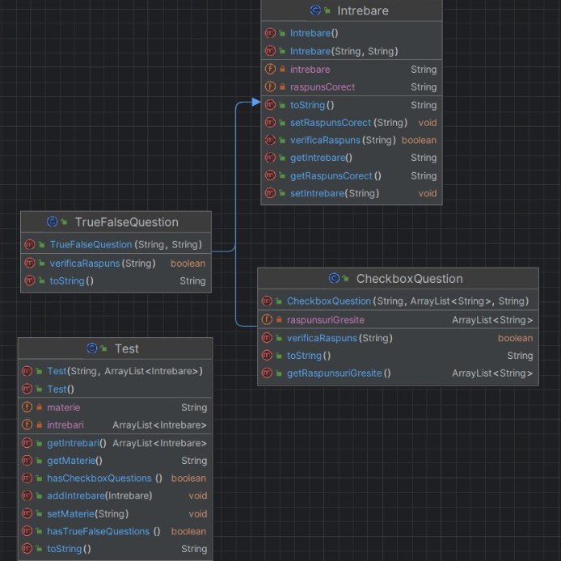
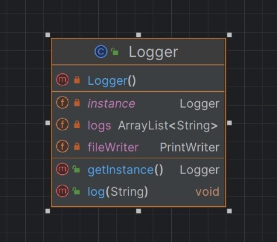
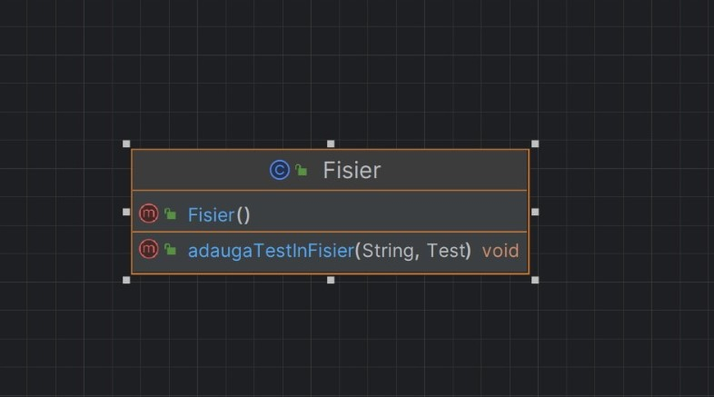
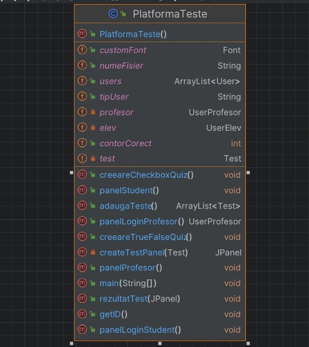

<!-- DESPRE PROIECT -->
# Despre proiect
   Proiectul are scopul de a Administra si Prelua teste in urma utilizarii unei parole si a confirmarii utilizatorului
La inceperea programului, v-a aparea o fereastra care cere o parola, 
parolele sunt standardizate (tip windows) .
iar apoi utilizatorii sunt Redirectionati catre o fereastra de Login.
In cazul in care utilizatorul nu exista , v-a fi nevoit sa se inregistreze ca apoi sa intre in Aplicatie.
Utilizatorii sunt de doua tipuri : Elev, Profesor;
Elevii au doar optiunea de le fi administrate teste la alegere si a fi punctati.
Pe cand Profesorii au doar  optiunea de a administra teste.
# Desciere Componente

## Pachetul Utilizator
Pachetul User contine 2 Clase si 1 Interfata.

#### Interfata User
Interfata cu scopul de definire a metodelor necesare pentru gestionarea utilizatorilor.
#### Clasa UserProfesor 
Clasa cu scopul de a particulariza interfata user pentru persoanele de tip Profesor;
Clasa ce implementeaza interfata User precum si metodele sale.

#### Clasa UserElev 
Clasa cu scopul de a particulariza interfata user pentru persoanele de tip Elev;
Clasa ce implementeaza interfata User precum si metodele sale.

## Pachetul Test
Pachetul Test contine 4 Clase dintre care 1 Abstracta

####  Clasa Abstracta Intrebare
Clasa Abstracta cu scopul de a generaliza intrebarile. Fiind o Clasa Abstracta , detine o metoda Abstracta de verificare a raspunsurilor.
Clasa este mostenita de catre clasele TrueFalseQuestion si CheckboxQuestion.

####  Clasa  TrueFalseQuestion
Clasa cu Scopul de a particulariza intrebarile pentru a fi utilizate cu raspunsuri de tipul 'adevarat' si 'fals'.
Clasa ce extinde Clasa Abstracta Intrebare si implementeaza metoda sa Abstracta .

####  Clasa  CheckboxQuestion
Clasa cu Scopul de a particulariza intrebarile pentru a fi utilizate cu  diferite raspunsuri dintre care unul singur corect.
Clasa ce extinde Clasa Abstracta Intrebare si implementeaza metoda sa Abstracta .

####  Clasa  Test
Clasa ce retine intrebarile depinzand de tipul lor  cu scopul de a  le utiliza  pentru a forma teste.

## Alte Clase

####  Clasa Singleton Logger 
Clasa Singleton ce adauga functia de logging in care se tine cont de activitatea utilizatorilor si o adauga in app.log

####  Clasa Fisier 
Clasa utilizata pentru adaugarea testelor intr-un fisier de tipul textfile

####  Clasa PlatformaTeste
Clasa cu scopul de vizualizare a proiectului si utilizare a tuturor claselor mentionate anterior.
Clasa ce contine totalitatea componentelor GUI , a validarilor de date si a stocarii.
Clasa PlatformaTeste utilizeaza o multitudine de metode , fiecare pentru o noua fereastra din cadrul programului.

